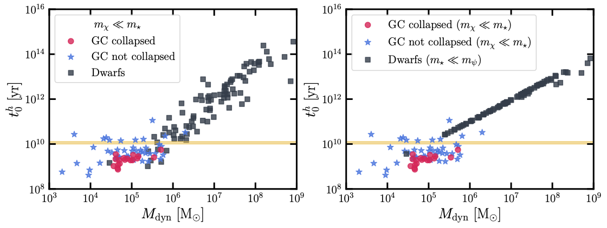

# Dynamical Evolution Timescales

Data for Figure 7 in ["Dynamical Evolutions in Globular Clusters and Dwarf Galaxies: Conduction Fluid Simulations"](https://arxiv.org/abs/2505.18251).

## Plot

*Typical Dynamical Evolution timescales (t₀ʰ) vs dynamical mass (M_dyn) for globular clusters and dwarf galaxies.*

## Data Files

- **`dsph.csv`** (87 dwarf spheroidal galaxies)
  - `id`: Galaxy identifier
  - `mass_dynamical [solar_mass]`: Dynamical mass
  - `t0h_light_darkmatter [yr]`: Timescale for m_χ ≪ m_⋆
  - `t0h_heavy_darkmatter [yr]`: Timescale for m_⋆ ≪ m_ψ

- **`Harris_collapsed.csv`** (18 collapsed globular clusters)
  - `id`, `mass_dynamical [solar_mass]`, `t0h [yr]`

- **`Harris_not_collapsed.csv`** (44 non-collapsed globular clusters)
  - `id`, `mass_dynamical [solar_mass]`, `t0h [yr]`

## Citation

If you use this data, please cite: [arXiv:2505.18251](https://arxiv.org/abs/2505.18251)

## Contact

If you have any questions, please contact Yiming Zhong (yiming.zhong@cityu.edu.hk).
